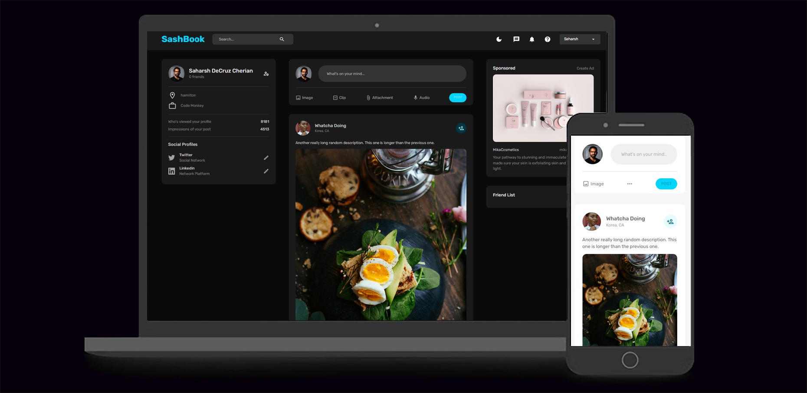

# SashBook

SashBook is Fullstack Responsive MERN Social Media App with Auth, Likes, & Dark Mode. 

## Table of Contents

- [Overview](#overview)
- [How to Use SashBook](#how-to-use-sashbook)
- [Technologies Used](#technologies-used)
- [Credits](#credits)

## Overview

SashBook lets you create a user profile, with a profile picture, sign in, and make interactive posts as well as interact with other users or friends' posts.

## How to Use SashBook:

As of now, SashBook is fully functional bt only through the CLI so the github repo would need to be downloaded and run with "npm start".

## Technologies Used:

- React
- MongoDB
- MUI
- Redux
- Formic
- Multer
- Helmet
- Express
- Node

### Links

 [Github Repo](https://github.com/sashdc/SashBook)

 ## Credits

[Cherian, Saharsh](https://github.com/sashdc)

